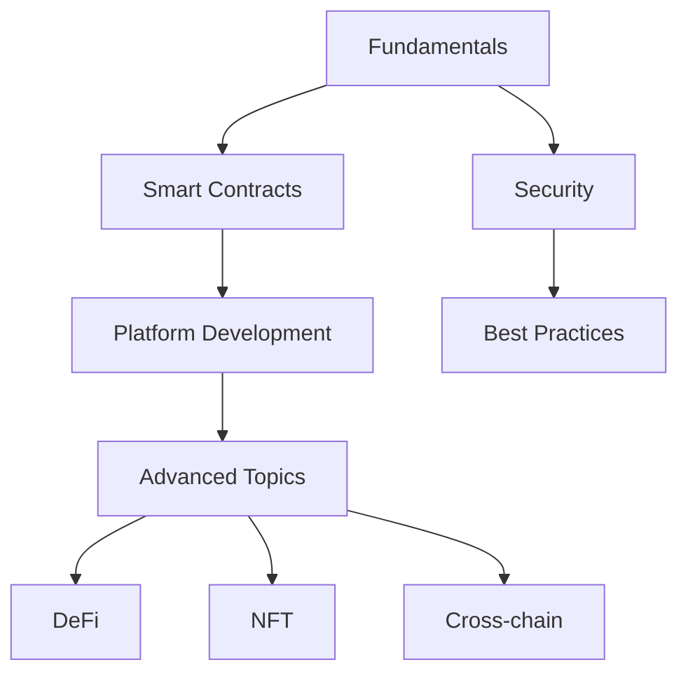
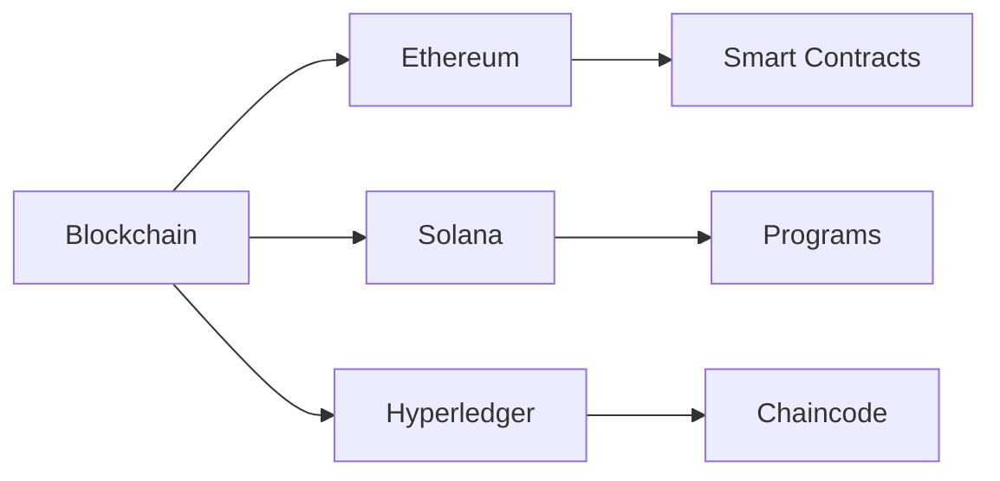
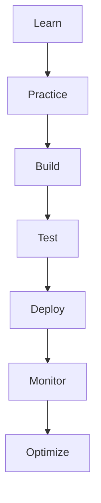
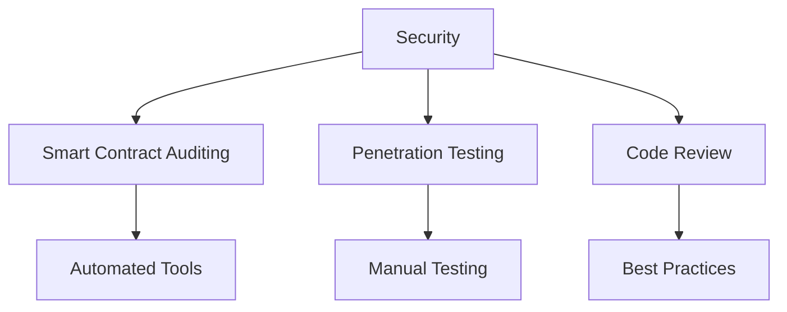

# Blockchain Technology Learning Resources

A comprehensive guide to blockchain technology, smart contracts, blockchain platforms, and emerging technologies. This repository provides structured learning paths, practical examples, and curated resources for blockchain developers at all levels.

## ⭐ Give a Star!
If you find this repository helpful or are using it to learn blockchain development, please give it a star. Thanks!

## 📋 Table of Contents
- [Core Areas](#-core-areas)
  - [Security & Emerging Technologies](#security--emerging-technologies)
  - [Blockchain Fundamentals](#blockchain-fundamentals)
  - [Smart Contracts](#smart-contracts)
  - [Blockchain Platforms](#blockchain-platforms)
  - [Advanced Topics](#advanced-topics)
  - [Infrastructure & Analysis](#infrastructure--analysis)
  - [Development Tools](#development-tools)
- [How to Use This Repository](#-how-to-use-this-repository)
- [Project Ideas](#-project-ideas)
- [Contributing](#-contributing)
- [Learning Resources](#-learning-resources)
- [License](#-license)

## ⚠️ Disclaimer
> This repository aims to provide a structured learning path for blockchain technology and its ecosystem. The content is designed to guide you in understanding core concepts and practical implementation, rather than promoting specific platforms or technologies. Remember that blockchain technology evolves rapidly - always verify information and stay updated with the latest developments.

## 📊 Learning Paths

### Beginner Path

### Technology Stack

### Development Process

### Security Considerations

## 📚 Core Areas

### Security & Emerging Technologies
- [Cybersecurity](./security/README.md)
  - Web Application Security
  - Data Protection
  - Encryption Methods
  - Security Auditing
  - Threat Modeling

- [Edge Computing & IoT](./edge-iot/README.md)
  - Edge Computing Concepts
  - IoT Architecture
  - IoT Protocols
  - Device Management
  - Edge Security

### Blockchain Fundamentals
- [Blockchain Basics](./fundamentals/README.md)
  - Distributed Ledger Technology
  - Consensus Mechanisms
  - Cryptography
  - Block Structure
  - Mining & Validation

### Smart Contracts
- [Smart Contract Development](./smart-contracts/README.md)
  - Solidity Programming
  - Contract Security
  - Testing & Deployment
  - Best Practices
  - Design Patterns

### Blockchain Platforms
- [Ethereum Development](./platforms/ethereum/README.md)
  - Ethereum Architecture
  - Web3.js/Ethers.js
  - DApp Development
  - Gas Optimization
  - Layer 2 Solutions

- [Solana Development](./platforms/solana/README.md)
  - Solana Architecture
  - Rust Programming
  - Program Development
  - Web3.js Integration
  - Performance Optimization

- [Hyperledger Development](./platforms/hyperledger/README.md)
  - Hyperledger Fabric
  - Chaincode Development
  - Network Setup
  - Private Blockchains
  - Enterprise Solutions

### Advanced Topics
- [DeFi Development](./defi/README.md)
  - AMM & Liquidity Pools
  - Lending Protocols
  - Yield Farming
  - Protocol Security
  - Token Economics

- [NFT Development](./nft/README.md)
  - Token Standards
  - Metadata Management
  - Marketplace Development
  - NFT Collections
  - Gaming & Metaverse

- [Cross-chain Development](./cross-chain/README.md)
  - Bridge Development
  - Cross-chain Messaging
  - Asset Transfer
  - Protocol Integration
  - Security Measures

### Infrastructure & Analysis
- [Layer 2 Solutions](./layer2/README.md)
  - Scaling Solutions
  - Rollups (ZK & Optimistic)
  - State Channels
  - Sidechains
  - Performance Optimization

- [Blockchain Analytics](./analytics/README.md)
  - Data Analysis
  - Indexing Solutions
  - Monitoring Tools
  - Market Intelligence
  - User Analytics

- [Blockchain Governance](./governance/README.md)
  - DAO Development
  - Voting Systems
  - Treasury Management
  - Proposal Systems
  - Community Management

### Development Tools
- [Development Environment](./tools/README.md)
  - Development Frameworks
  - Testing Tools
  - Wallets & Networks
  - Security Tools
  - Monitoring & Analytics

## 🎯 How to Use This Repository

1. **Choose Your Path**
   - For blockchain basics, start with fundamentals
   - For smart contract development, focus on Solidity and security
   - For platform-specific development, choose your preferred blockchain
   - For specialized development, explore DeFi, NFT, or Cross-chain sections
   - For infrastructure, explore Layer 2 and Analytics
   - For governance, explore DAO development
   - For emerging tech, explore Edge Computing & IoT
   - For security, focus on Cybersecurity fundamentals

2. **Follow the Learning Path**
   - Begin with blockchain fundamentals
   - Learn smart contract development
   - Practice with sample projects
   - Explore advanced concepts
   - Build real-world applications

3. **Essential Practices**
   - Understand cryptography basics
   - Follow security best practices
   - Test thoroughly
   - Stay updated with platform changes
   - Participate in the community

## 🚀 Project Ideas

### Beginner Projects
- Simple Token Contract
- Basic NFT Collection
- Voting System
- Multi-signature Wallet
- Decentralized Storage
- IoT Data Logger
- Security Audit Tool

### Intermediate Projects
- DeFi Protocol
- NFT Marketplace
- Cross-chain Bridge
- DAO Implementation
- Layer 2 Solution
- Edge Computing Gateway
- IoT Device Management System

### Advanced Projects
- DeFi Yield Aggregator
- NFT Gaming Platform
- Cross-chain DEX
- Governance System
- Analytics Platform
- Secure IoT Network
- Edge Computing Platform

## 📚 Learning Resources

### Books
- "Mastering Ethereum" by Andreas M. Antonopoulos and Gavin Wood
- "Mastering Bitcoin" by Andreas M. Antonopoulos
- "Token Economy" by Shermin Voshmgir
- "Building Games with Ethereum Smart Contracts" by Kedar Iyer
- "Hands-On Smart Contract Development" by Kevin Solorio

### YouTube Channels
- Ethereum Foundation
- Chainlink
- Moralis
- Dapp University
- Eat the Blocks
- Smart Contract Programmer
- Web3 Foundation

### Blogs & Newsletters
- Ethereum Blog
- ConsenSys Blog
- Week in Ethereum News
- Blockchain at Berkeley
- Coin Center
- The Block
- The Defiant

### Podcasts
- Unchained
- Zero Knowledge
- The Defiant
- Epicenter
- Blockchain Insider
- Web3 Innovators

### Development Tools
- Truffle Suite
- Hardhat
- Remix IDE
- OpenZeppelin
- Web3.js
- Ethers.js
- MetaMask

## 🤝 Contributing

Feel free to contribute by:
1. Adding new resources
2. Updating existing materials
3. Fixing errors or broken links
4. Improving documentation
5. Sharing project ideas

Please read our [Contributing Guidelines](CONTRIBUTING.md) before submitting a PR.

## 📝 License

This repository is licensed under the MIT License - see the [LICENSE](LICENSE) file for details.

## 🌟 Additional Resources

### Communities
- Developer Forums
- Discord Communities
- Technical Blogs
- Research Papers
- Conference Talks

### Tools
- Development IDEs
- Testing Frameworks
- Security Tools
- Monitoring Solutions
- Analytics Platforms
- IoT Development Kits
- Edge Computing Platforms

### Learning Platforms
- Online Courses
- Documentation
- Tutorials
- Workshops
- Certifications

## 👤 Author & Maintainer

This repository is maintained by [Donnivis Baker](https://github.com/dbsectrainer). For questions or feedback, please open an issue or reach out directly.

---
Last Updated: February 2025
